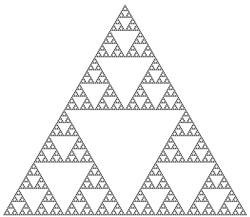
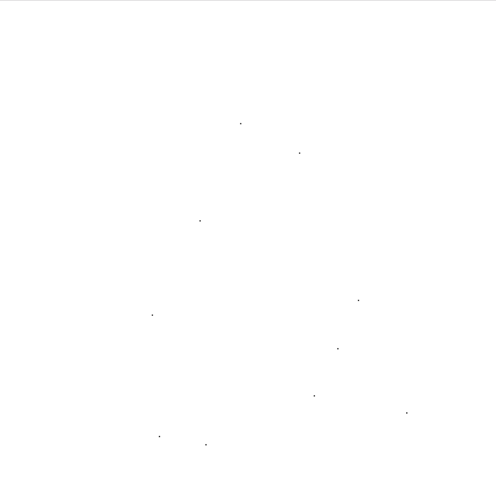
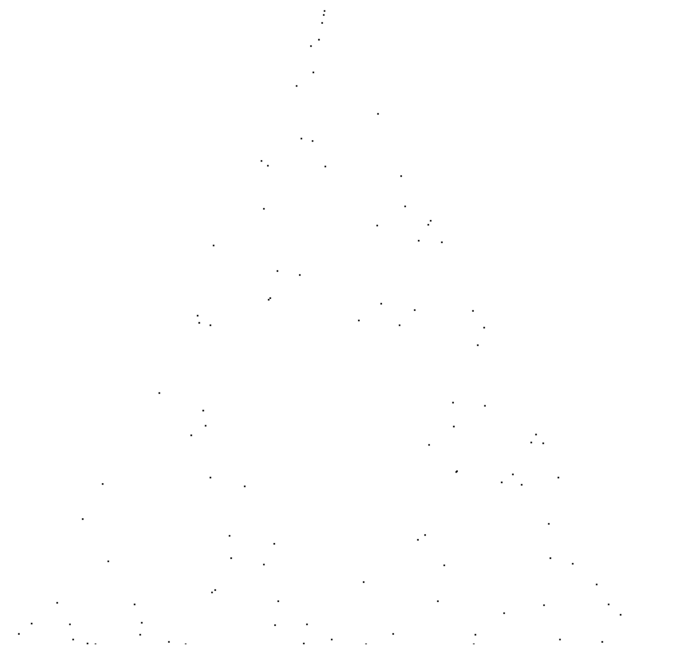
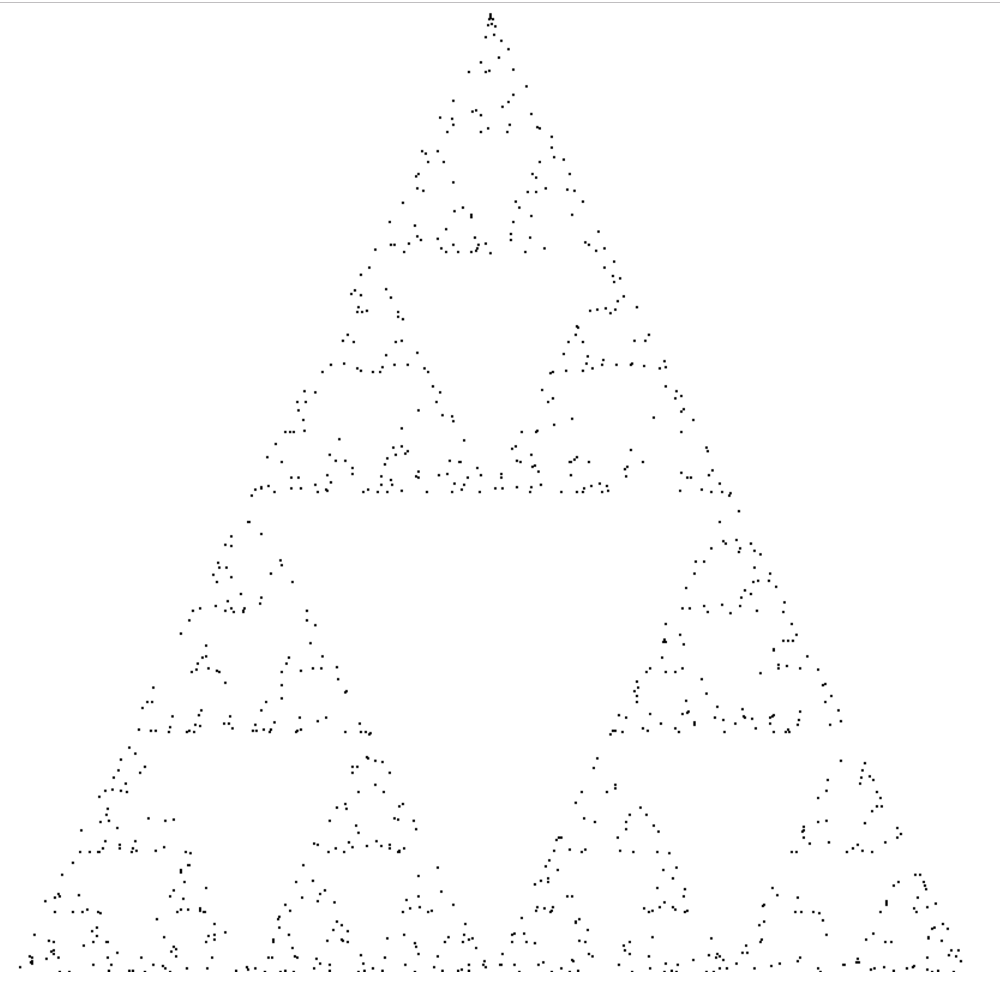
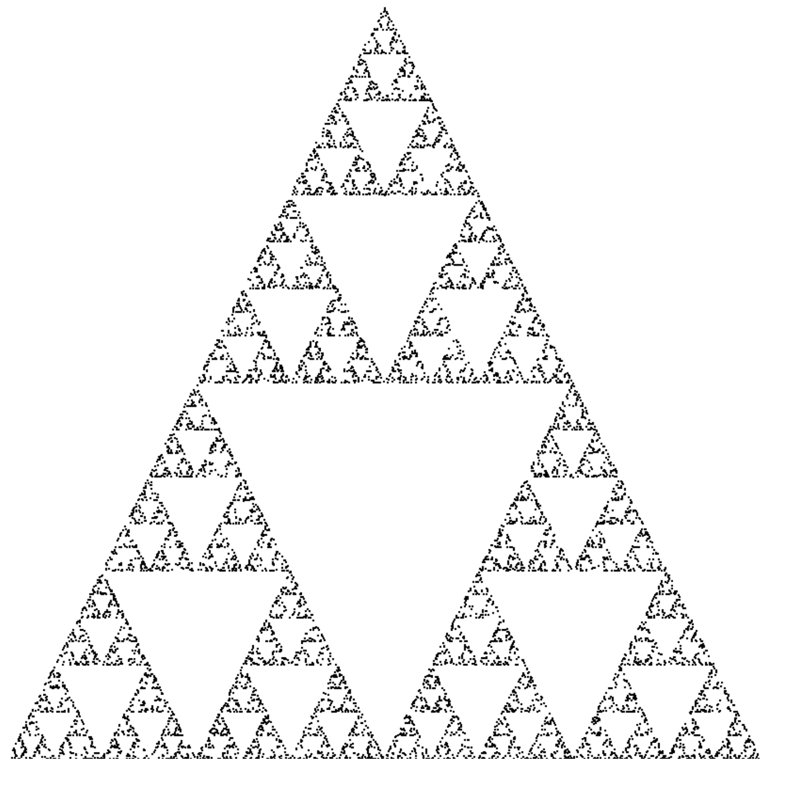
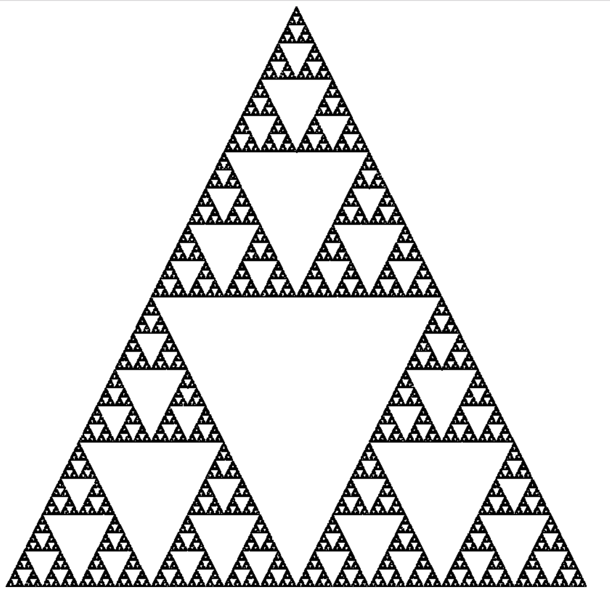

## WebAssembly を使って、Sierpinski の三角形を描いてみた

---

## WebAssembly とは

- Webブラウザ上で動くバイナリフォーマット
  - 既存技術である asm.js より容量が少ない
  - テキストフォーマットもある(S式)
- 他言語からコンパイルされ生成される
  - C/C++, Rust, TypeScript, C#, etc...
  - コンパイラによる最適化がかかるため, 高速
- 主要なブラウザは全て対応済

---

## Sierpinski の三角形



---

## カオスゲームによる作図

1. 正三角形の頂点を点A, B, Cとする
2. 正三角形の内部にランダムに点Pを置く
3. 点A, B, Cからランダムに点を一つ選択(点Qとする)
4. 点P, Qの中点を塗り、その点を新たにPとする
5. 3. 4. を無限に繰り返す。

---

## 設計方針

- wasm は 点を生成
- JS は 点を描画

---

## HTML コード

```html
<!DOCTYPE html>
<html>
  <head>
    <meta charset="utf-8">
    <title>Sierpinski Triangle</title>
  </head>
  <body>
    <canvas id="canvas" width="800" height="800"></canvas>
    <script src="bundle.js"></script>
  </body>
</html>

```

---

## wasm (Rust) コード

```rust
#[wasm_bindgen]
pub struct Point {
    #[wasm_bindgen(readonly)]
    pub x: u32,
    #[wasm_bindgen(readonly)]
    pub y: u32,
}

#[wasm_bindgen]
pub fn generate() -> Point {
    sierpinski_generator::generate() // 内部で点Pを保持する
}
```

---

## JS側のコード

```javascript
const js = import("./pkg/sierpinski_triangle_generator.js");
const N = 10000
const canvas = document.getElementById("canvas");

js.then(wasm => {
  for (let i = 0; i < N; i++) {
    let point = wasm.generate();
    drawRect(point.x, point.y, 2, 2);
  }
});

function drawRect(x, y, width, height) {
  var context = canvas.getContext("2d");
  context.fillStyle = "black";
  context.fillRect(x, y, width, height);
}
```

---

## 結果

---

## n = 1


---

## n = 10



---

## n = 100



---

## n = 1000



---

## n = 10000



---

## n = 100000


