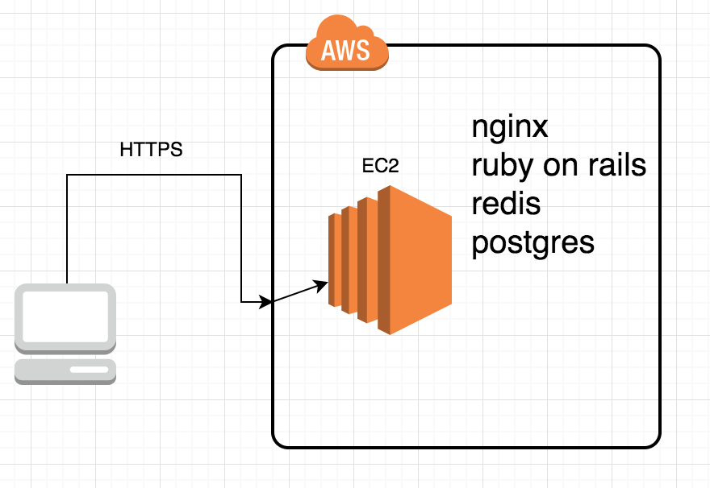
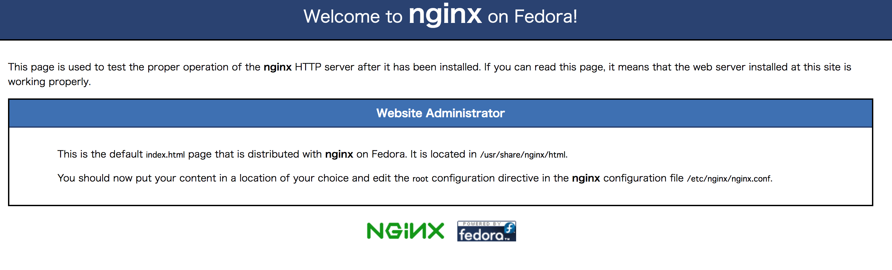

## AWS 初めてみた 
## - Mastodon Server の構築 - 

---

## 注意
- 途中経過です
- 3日じゃむりでした

---

## AWS とは

- Amazon.comにより提供されているクラウドコンピューティングサービス
- シェア１位！ドキュメントが充実！
- あとはよくわからん

---

## Mastodonとは

- 非中央集権型の分散SNS 
- オープンソースソフトウェア
- タイムラインが時系列順
- 画像、ショートビデオを投稿可能
- プライベートポストの概念がある
- OAuth2 and a straightforward REST API

---

## インフラ構成



---

## AWS アカウントの作成

- ルートアカウントの作成
- IAM ユーザーの作成
    - user: Administrator
    - group: Administrators
    - policy: AdministratorAccess
- ルートアカウントにMFAを追加

---

## EC2インスタンスを作成

- OS Type: Amazon Linux 2
- インスタンスタイプ: t2.micro
    - 仮想CPUx1, 2.5GHz
    - 1 GiB メモリ
    - ストレージボリューム EBS 8GiB

---

## セキュリティグループ

- HTTP TCP 80  myIP
- SSH  TCP 22  myIP
- HTTPS TCP 433 myIP

---

## ホストゾーンの設定

- Route53
- ドメインを購入
- IPv4 パブリックIPをAレコードに設定

---

- インフラの話はここでおしまい
- 次はインスタンスの中での話
- Mastodon をインストールします

---

## まえがき、辛かったこと

- 公式のインストールガイドはUbuntuを想定
- Ubuntu は Debian系
- 一方, Amazon Linux2 はRHEL7ベース
- そのため読み替えが発生した

---

## はじめに

```
screen
screen -ls

# タイムゾーン変更
timedatectl set-timezone Asia/Tokyo

# 日本語ロケール追加
localectl set-locale LANG=ja_JP.UTF-8

yum update -y

# スワップファイル作成
fallocate -l 4G /swapfile
chmod 600 /swapfile
mkswap /swapfile
swapon /swapfile
'/swapfile none swap sw 0 0' | sudo tee -a /etc/fstab
```

---

## Node.js, yarn をインストール

```
curl -sL https://rpm.nodesource.com/setup_10.x | bash -
yum install -y nodejs

curl -sL https://dl.yarnpkg.com/rpm/yarn.repo -o /etc/yum.repos.d/yarn.repo
yum install -y yarn
```

---

## Ruby, Bundler をインストール

- mastodon ユーザーを作成して実行

```
# 依存パッケージなど
yum install -y gcc-c++ make git
yum install -y https://dl.fedoraproject.org/pub/epel/epel-release-latest-7.noarch.rpm
yum install -y jemalloc-devel
yum install -y openssl-devel readline-devel zlib-devel

# rbenv をインストール
git clone https://github.com/rbenv/rbenv.git ~/.rbenv
cd ~/.rbenv && src/configure && make -C src
echo 'export PATH="$HOME/.rbenv/bin:$PATH"' >> ~/.bashrc
echo 'eval "$(rbenv init -)"' >> ~/.bashrc
source ~/.bashrc
git clone https://github.com/rbenv/ruby-build.git ~/.rbenv/plugins/ruby-build
RUBY_CONFIGURE_OPTS=--with-jemalloc rbenv install 2.6.1

# Ruby 2.6.1 を設定　
rbenv global 2.6.1

# Bundler インストール
gem update --system
gem install bundler --no-document
```

---

## PostgreSQLのインストールと起動　

```
yum -y install postgresql postgresql-server postgresql-contrib postgresql-devel
postgresql-setup initdb
systemctl start postgresql.service

# データベースの作成
sudo -u postgres psql
CREATE USER mastodon CREATEDB;
```

---

## Redis のインストールと起動

```
yum -y install redis
systemctl start redis.service
```

---

## SMTP サーバのインストールと起動

- やってない

---

## Mastodon インストール

- /home/mastodon/live/public がドキュメントルート

```
su - mastodon
git clone https://github.com/tootsuite/mastodon.git live && cd live
git checkout v2.9.0

sudo yum -y install protobuf-devel libidn-devel \
         libicu-devel
bundle install \
  -j$(getconf _NPROCESSORS_ONLN) \
  --deployment --without development test
yarn install --pure-lockfile
RAILS_ENV=production bundle exec rake mastodon:setup
```

---

## Nginxのセットアップ

```
yum -y install nginx
mkdir -p /etc/nginx/sites-available/mastodon
mkdir -p /etc/nginx/sites-enabled/mastodon
cp /home/mastodon/live/dist/nginx.conf /etc/nginx/sites-available/mastodon
ln -s /etc/nginx/sites-available/mastodon /etc/nginx/sites-enabled/mastodon
systemctl start nginx
```

---

## SSL証明書発行

-- Let's Encript を使う

```
yum -y install certbot python-certbot-nginx
certbot --nginx -d example.com
```

```
Domain: example.com
Type:   connection
Detail: Fetching
http://example.com/.well-known/acme-challenge/-il_0IFACr9fvDr7gIgNnGAwagj4dQCHYZPJZTmooU4:
Timeout during connect (likely firewall problem)
```

---

## アクセスすると



---

## 今後

- Mastodon Server構築
- リッチなインフラ構成

