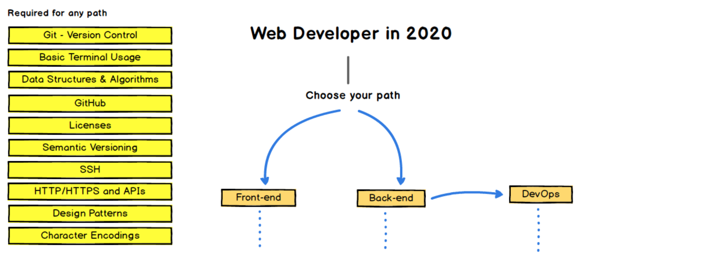

### DevOps Roadmap を歩く

---

### WEB DEVELOPER ROADMAP 2020

https://github.com/kamranahmedse/developer-roadmap

---

### What is WEB DEVELOPER ROADMAP?

- frontend, backend, devOps技術のチャート図
- 作者: Kamran Ahmed
- 元々、作者がいた大学の教授のために作ったらしい
- ウェブサイト版もあります https://roadmap.sh 

---

### WEB DEVELOPER ROADMAP の目的

- 次に何を学べばいいか混乱している人へ助けに
- 流行のものを薦めるものではない
- いくつかのケースである技術が他の技術よりなぜ優れているかの理解に
- 流行の技術が仕事に最適であると覚えてはいけない

---

### Introduction

</img>

---

### DevOps?

```
高い品質を確保しつつ、システムへの変更をコミットしてから通常の運用に
移るまでの時間を短縮することを目的とした一連のプラクティス
```
- wikipedia「DevOps」
- 技術的にはCI/CDのことだと思っていただければ

---

### なぜ DevOps RoadMap?

- 自分が弱い分野
  - 個人開発をやってる分にはたどり着かない

- 発表ネタが切れてきた
  - 当初考えていたネタはすでに発表済み

---

### はじめに

</img>

---

### それでは鑑賞タイム
- https://github.com/kamranahmedse/developer-roadmap

---

### 今後

- ここにある項目を一つずつ制覇していく
    - 個人的には逆走したい

