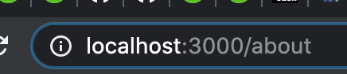

## 続続続Mastodonサーバーを立てる

---

### 今回もダメだったよ...
- 今年中にはケリをつけたい

---

## 前前前回 (2019/05)
 - EC2にMastodonのソースビルドをしていた
 - DB,Cache Serverなどを全てEC2放り込むクソザコインフラ構成

---

## 前前回 (2020/09)

- 目標

  - クソザコインフラ構成を見直し, terraformでコード化
  - ECS(Elastic Container Service)上にアプリコードをのせる

- 結果
  - ECSとDockerの連携でAWSのリソース権限関係でハマっておしまい。

---

### 前回 (2020/10)

- まず、ローカル(自PC)にMastodon立ち上げてみよう！
  - 一足飛びにやらずにね

- 結果
  - 建てたサーバの証明書を発行しようとするあたりで朝に

---

### そして、今回

ローカル(自PC)にMastodon立ち上げ、できました。

---

### 前回のハマりどころ

- 現行のMastodonではHTTPS onlyに
- 証明書どうするん...(途方に暮れる)

```
% curl http://localhost:3000
<html><body>You are being <a href="https://localhost/">redirected</a>.</body></html>%
```

---

### どうするか

---

### そうだ、HTTPS only をやめてしまおう

- local(自PC)で動くのを確認すればいい

---

### 前提: HSTS

- HTTP Strict Transport Security
- サイトにHTTPでアクセスするとHTTPSにリダイレクトする仕組み

---

### 洞察

- リクエストの挙動をみるに、Mastodonのサーバーもこの設定が
されている（はず）
- その設定を削除すれば、HTTP接続が可能になるのでは？

---

### Rails HSTS でぐぐる

- Mastodonのアプリケーションサーバーは Rails製
- 結果、以下を書き込むとHSTSがうごくらしい

```
config.force_ssl = true
```

---

### ソースコードを全文検索にかける

いた

```
% grep -rn 'force_ssl' .
./app/controllers/application_controller.rb:8:  force_ssl if: :https_enabled?
```

---

### 該当のコードをコメントアウトする


```
% git diff
diff --git a/app/controllers/application_controller.rb b/app/controllers/application_controller.rb
index 2201e463e..ca7cdc466 100644
--- a/app/controllers/application_controller.rb
+++ b/app/controllers/application_controller.rb
@@ -5,7 +5,7 @@ class ApplicationController < ActionController::Base
   # For APIs, you may want to use :null_session instead.
   protect_from_forgery with: :exception

-  force_ssl if: :https_enabled?
+  # force_ssl if: :https_enabled?

   include Localized
   include UserTrackingConcern
```

---

### 再ビルド

```
% docker-compose build
% docker-compose up -d
```

---

### できました




---

### まとめ

- local環境でMastodonが動いた
  - 挙動の確認ができる
  - ビルドのゴールを把握した

- 次はいよいよ ECSで動かすぞ！
