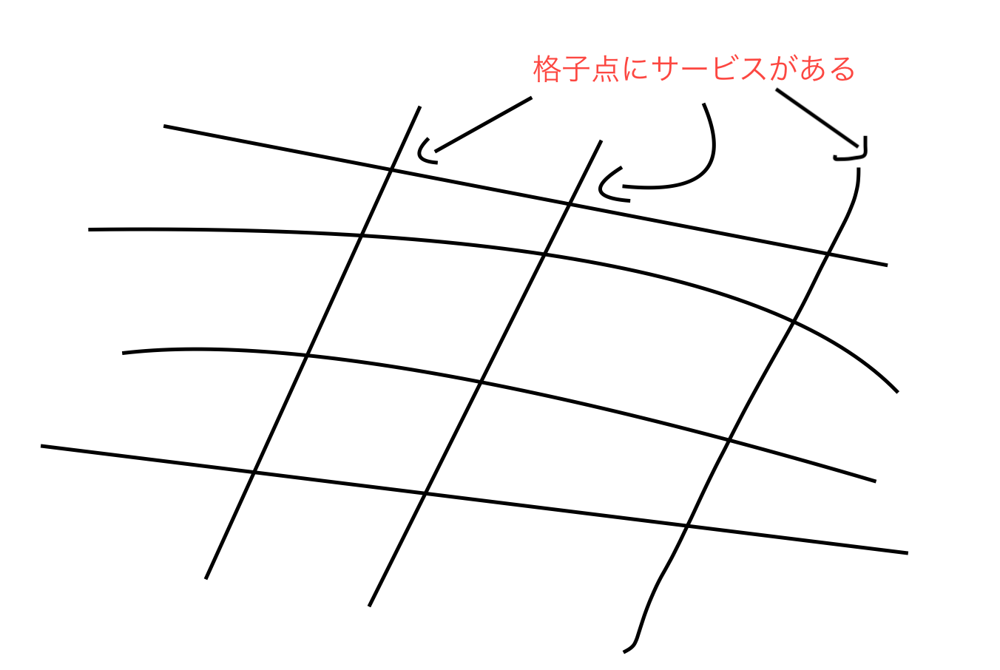

## Service Meshを説明しようとして時間が無かった話

---

### TL;DR (要約)

ここらへんをよめ。

- https://deeeet.com/writing/2018/05/22/service-mesh
- https://qiita.com/mamomamo/items/92085e0e508e18bc8532#comments

---

### 注意: エンジニア向け

Service Mesh 具体的なソフトウェアですが、
違った切り口で説明します。

---

### Service Mesh

- Service: いったん説明は保留します
- Mesh: 網目の織物, 網の目

---

### イメージ

---

### Service ?

具体的には...

- 会員登録機能
- ポイント補充機能
- 購入機能

etc..

---

### 今までと何が違うの

- 昔からあるWebアプリケーションは monolithic
  - monolithic: 一本石の(ような)

---

### monolithicだとつらいところ

- 修正したコードの影響範囲が見積もりづらい
- 関係ない機能もリリース対象になり無駄がある

---

### 近年の流れ

- monolithicなアプリケーションを脱却しよう
- サービスを適当に分割しよう -> MicroServices化へ
- 補足: コンテナとオーケストレーションの技術が発達した

---

###  MicroServices化の課題

- サービス間の通信は何でするの？
- サービス間の通信を失敗したらどうするの？
- サービス間の依存関係をどう把握するの？
- サービス間でのアクセシビリティをどうするの？
- 個々のサービスがどういう状況かどう監視するの？

---

### それを解決するのが Service Mesh だ

- MonolithなWebアプリケーションから、分散的なMicroserviceアプリケーションに移行する際に生じる課題を解決するソフトウェア
- またはネットワーク基盤とも

---

### 代表的なソフトウェア

- Istio (GitHub stars: 25.5k)
- consul (stars: 20.7k)
- linkerd2 (stars: 6.3k)

---

### この先は君の目で確かめてくれ

- 言い訳: 結構読んだけど、説明できるまでにいかなかったよ
- 言い訳: Kubernetes前提なのでつらい
- 年明けに、Istio の Examplesをやってみます...
